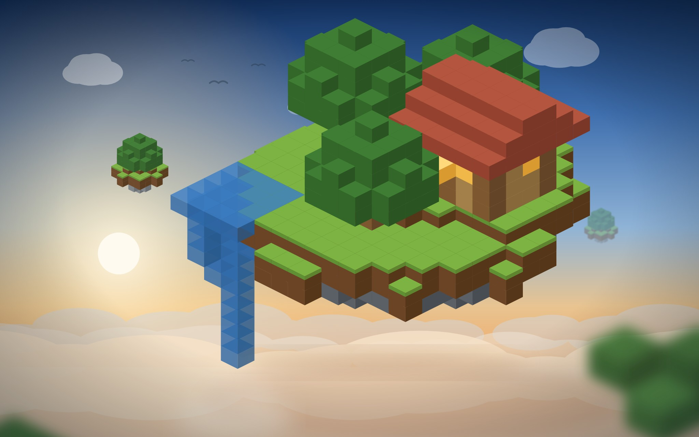
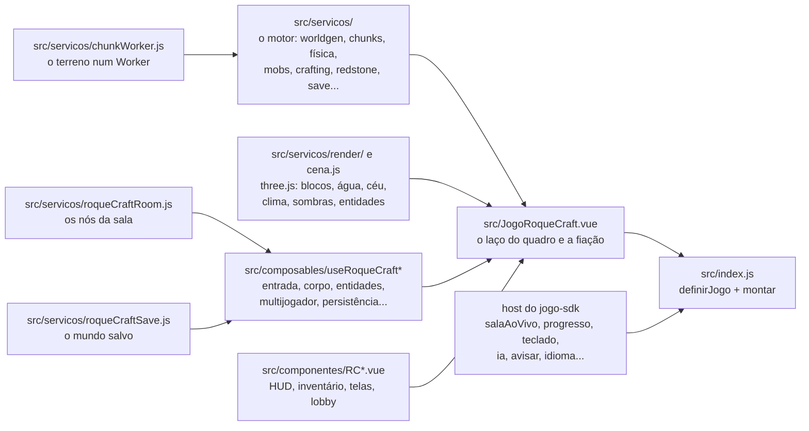

# RoqueCraft

O RoqueCraft do [RoqueOS](https://roqueos.com.br): um mundo de blocos infinito, gerado por
semente, em 3D. Biomas, cavernas, minério, dia e noite, fome e vida; minere, fabrique, plante,
crie bichos, construa, atravesse portais para outras dimensões. Sozinho ou numa sala com amigos,
no mesmo mundo, em tempo real. Jogue em
[roqueos.com.br/jogar/roquecraft](https://roqueos.com.br/jogar/roquecraft).

_English below._

## Por que existe

Até 26/09/2026 este jogo morava dentro do repositório do RoqueOS e falava direto com as stores
do sistema, com o Firebase (a sala no Realtime Database, o mundo no Firestore), com o Quasar, com
o i18n do sistema e com o provedor de LLM do NPC. Agora ele é um repo próprio na organização
[roqueos-games](https://github.com/roqueos-games), aberto, e fala com o RoqueOS só pelo
[`jogo-sdk`](https://github.com/roqueos-games/jogo-sdk). O mesmo código roda no RoqueOS, sozinho
no seu navegador (`yarn dev`) e no teste. O id do jogo continua `roquecraft`, e é por ele que o
save e a sala se acham.

## Como se joga

| Ação                           | Como                                                      |
| ------------------------------ | --------------------------------------------------------- |
| andar, olhar                   | WASD e o mouse; no celular, os controles de toque da tela |
| pular                          | espaço                                                    |
| correr, agachar                | Ctrl (ou dois toques no W), Shift                         |
| quebrar, colocar               | botão esquerdo, botão direito                             |
| inventário                     | E                                                         |
| escolher o item da mão, largar | 1 a 9, Q                                                  |
| mapa                           | M                                                         |
| voar (modo criativo)           | dois toques no espaço, ou F                               |
| painel do criativo             | K                                                         |
| chat (na sala)                 | T                                                         |
| fechar a tela de cima, pausar  | Esc                                                       |

O aldeão conversa por um modelo de linguagem quando o host oferece a capacidade `ia` e diz que
há modelo agora. Sem ela, com o modelo fora do ar ou demorando, ele responde com as falas
locais do jogo.

## Arquitetura

- O motor (`src/servicos/`, 147 arquivos) é a regra, quase toda sem Vue e sem DOM: a geração do
  mundo por semente, os chunks, a física, os bichos, a fabricação, a agricultura, a redstone, as
  dimensões, o formato do save e o da sala.
- O terreno é gerado e malhado num Worker (`src/servicos/chunkWorker.js`), criado por
  `new Worker(new URL('./chunkWorker.js', import.meta.url), { type: 'module' })`, que é o padrão
  que o Vite empacota como arquivo próprio, inclusive vindo de dependência.
- `src/servicos/render/` e `src/servicos/cena.js` desenham tudo com
  [three.js](https://threejs.org): os blocos com textura PBR, a água, o céu, o clima, as
  sombras, as entidades e a mão. O perfil de qualidade começa em `low` quando o host pede o modo
  leve.
- Os composables `src/composables/useRoqueCraft*.js` são as partes do jogo com ciclo de vida
  (entrada, corpo, entidades, mundo vivo, multijogador, persistência, painéis); os
  `src/componentes/RC*.vue` são a interface.
- `src/JogoRoqueCraft.vue` junta tudo: o laço do quadro, a fiação com o host e o gancho
  `window.__roquecraft` de QA (só em modo E2E).
- `src/index.js` cria um app Vue próprio dentro do elemento que o host entrega e devolve
  `{ ativar, desmontar }`. Só a janela ativa escuta o teclado, e ela o reivindica no host
  enquanto nenhuma tela do jogo está aberta.
- `jogo.json` é o manifesto: nome e descrição nos dez idiomas, SEO, etiquetas, capa, ícone,
  tamanho de janela, `aceitaConvite` e as capacidades `salaAoVivo` e `progresso` (`teclado` e
  `ia` são usadas quando o host as tem). O RoqueOS confere que ele bate com o catálogo.

O `three` e o `qrcode` são `peerDependencies`: o RoqueOS fornece os dele, e o jogo não traz
outros. As versões exatas em `devDependencies` são as mesmas que o RoqueOS instala, para o teste
e o `yarn dev` verem o que o jogador vê.

## O que o jogo guarda

- **O mundo**, na conta, pela capacidade `progresso`: semente, as edições do mundo, as outras
  dimensões, o jogador (posição, inventário, vida, fome, efeitos, modo), ajustes, mobília, ponto
  de renascimento, itens no chão e bichos. Cada gravação substitui o documento inteiro (sem
  `mesclar`), 2,5 s depois da última mudança. Não grava sem o `progresso` disponível, dentro de
  uma sala (o mundo é do anfitrião) nem em modo E2E.
- Se a leitura do save falhar, o jogo avisa com um aviso fixo e **não grava por cima** do save
  que não conseguiu ler (a regra RC-02 do front, com teste).
- Não há recorde nem placar: o RoqueCraft não entra no Pódio e não manda evento de métrica.

### ⚠️ O save que o banco recusa

O formato do save tem **array dentro de array**: o inventário (`[casa, item, quantidade, ...]`
por item), as casas da mobília e as `outrasDimensoes`. O Firestore recusa isso ("Nested arrays
are not supported"), e o host do SDK (o falso e o de desenvolvimento) recusa igual. Na prática,
o mundo deixa de ser gravado assim que o inventário tem um item. O formato não foi mudado na
extração, de propósito: é decisão do founder. Os testes que mostram o defeito estão marcados
com `it.fails` em `test/servicos/saveNaConta.spec.js` e `test/jogoRoqueCraft.spec.js`; quando o
formato for corrigido, eles passam a reprovar e o `it.fails` sai.

## A sala

A sala é do host, pela capacidade `salaAoVivo` do SDK. O jogo não fala com banco nenhum: o host
dá o código, o link do convite, quem é o jogador e o nó da sala, e o jogo lê e escreve caminhos
dentro dela. Os nós são os de antes da extração, de propósito, porque do outro lado pode estar
um RoqueOS antigo:

| Nó                   | Quem escreve    | O que é                                                                                       |
| -------------------- | --------------- | --------------------------------------------------------------------------------------------- |
| `meta`               | o host e o jogo | `seed` e `mode` (do jogo); `host`, `hostName`, `createdAt` (do host); `host` muda na sucessão |
| `players/{uid}`      | cada jogador    | nome, skin, ação, posição, vida, item na mão, hora                                            |
| `blocks/{chunk}/{i}` | todos           | o bloco que mudou; quem cria a sala semeia as edições do mundo dela                           |
| `mobs`               | o anfitrião     | o retrato dos bichos (`snap`) e a hora                                                        |
| `relogio`            | o anfitrião     | a hora do dia (`ticks`) e a chuva forçada                                                     |
| `mobilia/{chave}`    | todos           | baús, fornalhas e suportes de poção, no formato do save                                       |
| `hits/{chave}`       | os convidados   | a intenção de golpe (`m`, `d`, `by`), que o anfitrião aplica e apaga                          |
| `chat/{chave}`       | todos           | `uid`, `name`, `text`, hora; a tela mostra as últimas 60                                      |

O anfitrião simula os bichos e o relógio; o convidado desenha o que chega e manda intenções.
Quando o anfitrião sai e há mais gente, o próximo assume. Sem conta não há sala: o host recusa,
e o lobby avisa que é preciso entrar na conta.

No `yarn dev`, o host de desenvolvimento do SDK faz a sala entre abas do mesmo navegador, pelo
`localStorage`: em "Jogar com amigos", crie a sala numa aba e abra o link (a própria página com
`?sala=<código>`) numa aba nova. Não duplique a aba, que vira o mesmo jogador. O host de
desenvolvimento não emula as regras do banco.

### Limitações conhecidas

- Quem entrou numa sala não tem o link do convite (o contrato só dá o link a quem cria): o QR
  fica vazio e "copiar convite" copia o código.
- O convite é lido uma vez, quando o jogo abre. Um segundo convite com a janela já aberta não
  chega ao jogo.
- Quando a conexão do anfitrião cai com gente na sala, a presença dele fica (a limpeza da queda
  foi cancelada junto com a da sala), e a sucessão não acontece. Era assim antes da extração; o
  teste que mostra está marcado com `it.fails` em `test/composables/salaComHostFalso.spec.js`.
- O aviso de "entre na sua conta" aparece depois que o host recusa a sala, não antes do clique.

## Pré-requisitos

- Node 24 (o `.nvmrc` diz), ou 22 no mínimo.
- Yarn 1.22.

## Como rodar

1. `yarn install --ignore-scripts`
2. `yarn dev` e abra o endereço que o Vite mostrar: o jogo roda com o host de desenvolvimento do
   SDK, com o mundo salvo no `localStorage`.
3. `yarn verificar` antes de abrir PR: lint, formato, testes e o `jogo check`, o mesmo que o CI
   roda.

O teste roda no jsdom, que não tem WebGL: o `three` é trocado por um dublê
(`test/threeStub.js`). Verde no teste não diz nada sobre o desenho na GPU. Mudança no código que
toca a GPU (`src/servicos/render/`, `cena.js`, clima, água, céu, sombras, texturas, perfis de
qualidade) precisa ser vista num iPhone de verdade antes de subir. Os roteiros de navegador que
vieram do RoqueOS estão em [`qa/`](qa/README.md).

## Estrutura

| Caminho                | O que é                                                                                                                                                         |
| ---------------------- | --------------------------------------------------------------------------------------------------------------------------------------------------------------- |
| `src/servicos/`        | o motor, o Worker do terreno e o formato do save e da sala                                                                                                      |
| `src/servicos/render/` | o desenho na GPU (three.js)                                                                                                                                     |
| `src/composables/`     | as partes do jogo com ciclo de vida                                                                                                                             |
| `src/componentes/`     | a interface (`RC*.vue`) e os estilos dela                                                                                                                       |
| `i18n/`                | um JSON por idioma, com as mesmas chaves nos dez                                                                                                                |
| `public/`              | capa e ícone; `public/games/roquecraft/` tem texturas, arte e som, no caminho em que o jogo os carrega. A origem de cada arquivo está no [ASSETS.md](ASSETS.md) |
| `test/`                | testes com o host falso do SDK e o dublê do three, sem nada do RoqueOS                                                                                          |
| `qa/`                  | os roteiros de navegador e os geradores de asset que vieram do RoqueOS                                                                                          |
| `docs/`                | a regra de arquitetura, os planos e o dev-doc do jogo, como estavam no RoqueOS                                                                                  |
| `dev/`, `index.html`   | o jogo sozinho no navegador, para desenvolver                                                                                                                   |
| `jogo.json`            | o manifesto que o RoqueOS lê                                                                                                                                    |

## Onde ele se encaixa

O RoqueOS instala este repo por uma tag exata e monta o jogo pelo `mount` do SDK, na janela, em
`/jogar/roquecraft`, e serve os arquivos de `public/games/roquecraft/` no mesmo caminho
`/games/roquecraft/`. Uma mudança aqui só chega ao RoqueOS quando uma tag nova é pinada lá,
depois de revisada. Não mudam sem decisão: os nós e campos da sala, os campos do save (com a
`version` dele), e o gancho `window.__roquecraft` (só em modo E2E), que o QA do RoqueOS usa.

## Licença

MIT no código e na arte (capa, ícone, fundo do menu). As texturas dos blocos e os ícones de
item são autorais, desenhados pelos geradores de `qa/`, e as texturas são CC0, como o gerador
delas declara. O som é CC0 (Kenney e OpenGameArt, mais dois leitos sintetizados). A origem de
cada arquivo está no [ASSETS.md](ASSETS.md) e a do som também no
`public/games/roquecraft/audio/CREDITOS.md`. Veja [LICENSE](LICENSE).

---

## English

RoqueCraft from [RoqueOS](https://roqueos.com.br): an infinite, seed-generated 3D block world.
Biomes, caves, ore, day and night, hunger and health; mine, craft, farm, breed animals, build and
travel through portals to other dimensions, alone or in a real-time room with friends. It talks
to RoqueOS only through the [`jogo-sdk`](https://github.com/roqueos-games/jogo-sdk), so the same
code runs inside RoqueOS, standalone in your browser and in tests.

- `yarn install --ignore-scripts`, then `yarn dev` to play it locally. Rooms work between two
  tabs of the same browser: create one under "Jogar com amigos" and open its link in a new tab.
- `yarn verificar` runs lint, formatting, tests and `jogo check`, exactly like CI.
- Terrain is generated and meshed in a Web Worker created with the
  `new Worker(new URL(..., import.meta.url))` pattern, which Vite bundles as its own file.
- The world is saved through the host's `progresso` capability, replacing the whole document.
  ⚠️ The save format contains nested arrays (inventory, containers, other dimensions), which
  Firestore and the SDK hosts reject: once the inventory holds an item, the world stops being
  saved. This is known, kept on purpose and pinned by `it.fails` tests.
- Rooms come from the host (`salaAoVivo`); the game never talks to a database. Room nodes and
  fields keep their pre-extraction shape on purpose.
- The villager talks through an LLM when the host offers the `ia` capability, and falls back to
  local lines otherwise.
- Tests run in jsdom with a `three` stub; they say nothing about the GPU. Changes under
  `src/servicos/render/` need to be checked on a real iPhone. The browser probes that came from
  RoqueOS live in `qa/`.
- Code and comments are in Brazilian Portuguese; issues and pull requests in English are
  welcome.

MIT licensed code; original art and textures; CC0 audio (Kenney, OpenGameArt), see `ASSETS.md`.
