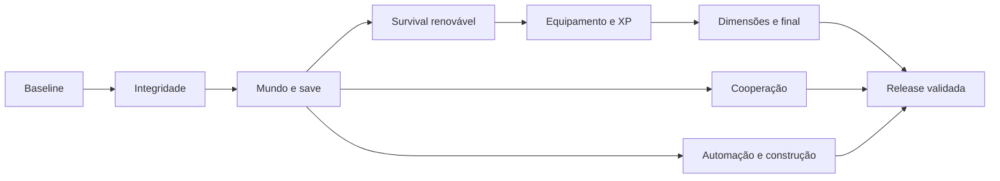

# RoqueCraft — auditoria e plano de conclusão

Data: 2026-09-06. Base analisada: `6eaa5b3a375c3b01c3a1b09d0e6c7ddfa17504b1`.
Referência escolhida pelo fundador: **Minecraft Java, com controles adaptados para web e mobile**.
Status: planejamento; nenhuma implementação de gameplay nesta rodada.

## 1. Conclusão

O RoqueCraft já possui uma base técnica substancial. A melhor direção é evoluir os serviços existentes e completar jornadas de jogador. Os maiores bloqueios são integridade de progresso, sistemas de sobrevivência desconectados, limites do modelo de mundo e multiplayer parcialmente compartilhado.

“Concluído” deve significar uma experiência verificável: começar sem itens, sobreviver, construir uma base sustentável, progredir equipamentos, explorar dimensões, vencer o desafio final e continuar construindo e automatizando, sozinho ou com amigos, podendo fechar e reabrir o jogo sem perder progresso.

Não há fundamento para atribuir uma porcentagem de conclusão apenas contando blocos, arquivos ou testes. Fidelidade precisa ser medida por comportamento e jornadas. Este plano cobre os grandes sistemas; a matriz exaustiva de itens, receitas e regras da edição de referência é uma entrega de M0, antes de prometer equivalência integral.

Usar Java 26.2 como referência documental congelada inicial, sem perseguir snapshots durante a implementação. Isso é uma proposta de versão, não uma preferência de versão já expressa pelo fundador. Preservar arte própria/procedural e a direção visual aprovada. Compatibilidade com servidores, mods, saves e resource packs completos do Minecraft não integra esta entrega; o carregador atual de texturas não equivale a essa compatibilidade.

## 2. Escopo e evidência

Auditoria estática dos serviços, composables, componentes, regras Firebase, testes e scripts QA. Não foram executados o jogo, builds ou testes do RoqueCraft nesta rodada. Achados de fluxo indicam defeitos/riscos a reproduzir; não são relatos de incidentes observados em produção. Metas de desempenho abaixo são propostas, não medições.

Inventário estático:

| Área                          | Arquivos | Linhas aproximadas |
| ----------------------------- | -------: | -----------------: |
| Serviços JS, incluindo render |       89 |             25.092 |
| Composables                   |        8 |              2.218 |
| Componentes RC                |        8 |              2.183 |
| ROSRoqueCraft.vue             |        1 |              2.545 |
| Specs de domínio              |      110 |             25.149 |
| Specs de composables          |        8 |              2.620 |
| Spec do componente principal  |        1 |                 23 |
| Scripts qa-roquecraft         |       64 |             17.104 |

Esses números contam arquivos e linhas, não casos aprovados. A existência de muitas specs não demonstra uma jornada integrada funcionando. O teste do componente principal apenas verifica a exportação, sem montar o jogo.

## 3. Capacidades atuais

| Sistema      | Estado observado                                                          | Falta para a experiência pretendida                                                            |
| ------------ | ------------------------------------------------------------------------- | ---------------------------------------------------------------------------------------------- |
| Mundo        | Seed determinística, 11 biomas, cavernas, minérios e vegetação            | Versão de geração, dimensões, altura flexível, estruturas e diversidade orientada à progressão |
| Render       | Three/WebGL, greedy meshing, AO, iluminação, céu/clima, quatro qualidades | Baseline real, worker ocioso, orçamento de memória, estabilidade mobile                        |
| Movimento    | Colisão, degraus, natação e voo                                           | Tempo de simulação consistente, foco correto e controles configuráveis                         |
| Inventário   | 36 slots, hotbar de 9, ferramentas e durabilidade                         | Conservação transacional, equipamentos/offhand e migração de metadados                         |
| Crafting     | Grades 2×2/3×3, livro, forno, combustível e baú                           | Receitas e obtenção coerentes, tags de materiais e variantes espelhadas                        |
| Survival     | Vida, fome, saturação, lava, afogamento, morte, cama e XP                 | Agricultura renovável, equipamentos, utilidade do XP e respawn robusto                         |
| Mobs         | 8 espécies terrestres e 4 aquáticas; combate e criação parcial            | Drops válidos, dietas específicas, ciclo ecológico e progressão de encontros                   |
| Construção   | Blocos e formas especiais, portas de cerca, camas e baldes                | Catálogo orientado à paridade, estados escaláveis e ferramentas de construção                  |
| Progressão   | Madeira, pedra, ferro e diamante                                          | Arco, armaduras, encantamentos, poções, estruturas, comércio e dimensões                       |
| Redstone     | Minério/item                                                              | Circuitos funcionais, componentes e automação                                                  |
| Persistência | Save v8, edits, entidades, mobília, jogador e ajustes                     | Isolamento por mundo, recuperação de falha, armazenamento por chunk e backups                  |
| Multiplayer  | RTDB, presença, posições, blocos, mobs e chat                             | Autoridade de ações, economia compartilhada e recuperação completa                             |
| Interface    | Desktop/mobile, componentes ROS e 10 idiomas                              | Jornadas reais em touch, acessibilidade, remapeamento e retorno de falhas                      |

## 4. Defeitos e riscos prioritários

Referências abaixo são caminhos a partir da raiz do repositório e linhas da base auditada.

| ID    | Prioridade | Evidência e consequência                                                                                                                                                              | Critério de correção                                                                                                              |
| ----- | ---------- | ------------------------------------------------------------------------------------------------------------------------------------------------------------------------------------- | --------------------------------------------------------------------------------------------------------------------------------- |
| RC-01 | P0         | `src/services/roquecraft/bancada.js:27–32,96–105`: retorno de `addItem` ignorado ao devolver grade/cursor e no craft direto; ingredientes podem ser consumidos sem acomodar resultado | Inventário cheio nunca perde itens; operação recusa integralmente ou preserva sobra explicitamente; teste de conservação          |
| RC-02 | P0         | `src/components/roqueos/apps/ROSRoqueCraft.vue:726–732,2143–2149`: falha de leitura segue como save ausente e autosave não exige carga bem-sucedida                                   | Distinguir inexistente de indisponível/corrompido; impedir sobrescrita após falha; recuperação testada                            |
| RC-03 | P0         | `src/composables/useRoqueCraftMultijogador.js:212–215,276–277` e componente `2183–2193`: restauração solo guarda seed/ticks, não a sessão completa; seed igual evita reset            | Solo → sala → solo restaura exatamente inventário, vida, posição, edits, mobília e entidades, inclusive mesma seed                |
| RC-04 | P0         | `database.rules.json:51–82`: escritas de ações não exigem participação na sala; caminho de hits não valida alcance/cooldown/autoridade                                                | Regras rejeitam não membros e payloads inválidos; autoridade valida intenção, distância e ritmo; emulador RTDB obrigatório        |
| RC-05 | P1         | `src/services/roquecraft/chunkPipeline.js:359,433–470`: halo gerado inclui iluminação sempre adiada; worker agenda enquanto fila permanece                                            | Após estabilizar mundo parado, worker fica ocioso; movimento/edição reativam corretamente                                         |
| RC-06 | P1         | `src/services/roquecraft/worldClient.js:85,95–104`: fallback usa parâmetros iniciais após resets/edições                                                                              | Falha de worker recupera seed, posição, distância e todas as edições atuais sem meshes de sessão anterior                         |
| RC-07 | P1         | `src/services/roquecraft/edicoes.js:24,53–60`: teto de 240.000 números/60.000 edits; `roqueCraftRoom.js:177–192`: sala recebe até 8.000 edits                                         | Nenhum truncamento silencioso; orçamento visível no formato atual e migração para snapshots completos por chunk                   |
| RC-08 | P1         | `ROSRoqueCraft.vue:1387–1390`: drop da morte não repassa durabilidade                                                                                                                 | Ferramenta recuperada conserva metadados; morte não repara nem duplica equipamento                                                |
| RC-09 | P1         | `src/services/roquecraft/mobs.js:216,233,248,268`: raw_fish/ink_sac sem registro; desserialização rejeita item desconhecido                                                           | Todos os drops/receitas referenciam IDs válidos; coleta → save → reload preserva conteúdo                                         |
| RC-10 | P1         | `ROSRoqueCraft.vue:1136` e `physics.js:350`: clamps diferentes de tempo, sem acumulador físico                                                                                        | Movimento equivalente em taxas de render diferentes; simulação com passo fixo e recuperação limitada                              |
| RC-11 | P1         | `src/services/roquecraft/worldClient.js:250–255`: edição muda blocos sem atualizar heightmap usado por heightAt                                                                       | Consultas de superfície corretas após construir/minerar e após reload                                                             |
| RC-12 | P1         | `src/services/roquecraft/ajustes.js:49–51`: distância salva alta pode permanecer em perfil mobile baixo                                                                               | Distância respeita orçamento medido do dispositivo; ajuste incompatível é limitado com retorno na UI                              |
| RC-13 | P1         | `src/composables/useRoqueCraftEntrada.js:60,104–128,267–280`: listeners globais sem escopo completo de janela/canvas e cancelamento                                                   | Outra janela não move o jogador; blur, visibilitychange e touchcancel soltam todos os comandos                                    |
| RC-14 | P1         | `roqueCraftRoom.js:244,255,328` e `useRoqueCraftMultijogador.js:216–228`: falhas de escrita/entrada não têm rollback completo                                                         | Entrada é atômica; falha volta ao estado anterior, remove listeners e informa problema; ação não confirmada não parece persistida |

P0 significa risco de progresso ou autoridade e bloqueia expansão sobre esses fluxos. Confirmar cada cenário em teste antes da correção e preservar o teste como regressão.

Outras lacunas de coerência: trigo existe mas não tem cadeia natural de produção; criação exige trigo para todas as espécies; galinha usa raw_beef; receitas de algumas madeiras e estante são simplificadas. Cama precisa ser revalidada ao respawn. XP acumula sem consumidores. Arco/flechas de jogador, armadura, offhand, encantamentos e poções não têm sistemas completos encontrados.

## 5. Arquitetura de evolução

1. **Identidade de mundo:** introduzir `worldId`, `dimensionId`, `schemaVersion` e `generatorVersion`. Seed não identifica uma sessão. Estado solo e estado de sala devem ter contextos separados.
2. **Registry e blockstates:** substituir dependência estrutural de IDs em um byte por representação versionada com paleta/estados. Não basta trocar um Uint8Array: ajustar tabelas, worker, mesher, rede e serialização. Preservar mapa de IDs legados e validar mais de 256 estados sem truncamento.
3. **Verticalidade/dimensões:** centralizar minY/maxY e chaves dimensionais; remover limites literais 126/127. Mundo atual é 16×128×16 por chunk. Manter geração antiga para saves antigos; novos mundos usam versão nova.
4. **Persistência:** snapshot por chunk, journal local durável, revisões e commits de manifesto; backups e export/import. Validar bytes reais contra os limites do backend. Retentar sincronização sem sobrescrever revisão mais recente; conflito de dispositivos precisa de solução explícita.
5. **Simulação:** regras puras em serviços; tick fixo para física e sistemas, render interpolado. Worker deve receber snapshot atual recuperável. Só adicionar pool de workers após perfil indicar ganho e dependências de vizinhança estarem explícitas.
6. **Economia:** operações de crafting, coleta, morte, container e comércio conservam quantidade/metadados e têm resultado explícito. IDs inválidos não podem ser silenciosamente aceitos e descartados no reload.
7. **Multiplayer:** clientes enviam intenções; uma autoridade valida e confirma efeitos. Host autoritativo é evolução inicial possível; servidor dedicado depende do requisito de confiança e operação, não é pré-requisito para reescrever tudo. Regras RTDB continuam obrigatórias. Definir autoridade de inventário, containers, drops, mobs, tempo e clima antes de expandir sincronização.
8. **Interface:** entrada normalizada por ações, com adaptadores teclado/mouse/touch; foco da janela e canvas; preferências persistidas. Composables cuidam do ciclo de vida, RC\*.vue da UI e serviços das regras. Reduzir o componente principal por responsabilidade, sem refatoração geral desvinculada de entregas.

Preservar Vue, JavaScript, yarn, primitivas ROS, i18n e a separação atual entre jogo e render. Mudanças em contratos compartilhados devem passar pelo blast/gate do ecossistema. A configuração Claude existente permanece independente do adaptador Codex.

## 6. Marcos executáveis

### M0 — Baseline e contrato de fidelidade

- Transformar esta auditoria em casos reproduzíveis; montar o componente real e executar abertura/fechamento, primeira noite, save/reload e entrada/saída de sala.
- Criar matriz Java: mecânica, regra de referência, implementação atual, decisão de adaptação, fixture/teste, prioridade. Inventariar blocos, estados, itens, receitas, mobs, drops, biomas e estruturas sem usar documentação histórica como inventário atual.
- Definir aparelhos desktop/mobile reais e capturar FPS, p95/p99, memória, worker, bytes de save e tráfego.
- Consolidar scripts QA: quais realmente fazem assertions, quais apenas imprimem relatórios e quais dependem de ambiente externo. Um cenário falho precisa sair com código não zero.
- Saída: baseline reproduzível, bugs confirmados e backlog rastreável. Estimar duração somente após essa calibração.

### M1 — Progresso seguro e execução estável

- Resolver RC-01 a RC-14 em PRs pequenos, priorizando RC-01 a RC-04. Aplicar contenção de limite de save/sala até M2 eliminar os tetos.
- Cobrir atomicidade, IDs/durabilidade, rollback de sessão e falha de load/save.
- Montar testes reais do componente e adicionar RTDB aos emuladores de regras.
- Saída: zero perdas/duplicações nos cenários de regressão; mundo solo intacto após sala; nenhuma escrita destrutiva após load falhar; worker ocioso e controles liberados ao perder foco.

### M2 — Mundo e armazenamento preparados para crescer

- Implementar contratos de mundo, registry/blockstates e armazenamento por chunk com migração v8.
- Adicionar slots de mundos, backup/exportação/importação e recuperação offline/reconexão.
- Introduzir dimensões/minY/maxY no contrato, ainda com o conteúdo atual; manter continuidade de chunks antigos.
- Saída: fixtures antigas abrem sem perda; mais de 256 estados fazem round-trip; cenário de 100.000 edições não trunca; crash no meio da gravação recupera último commit válido. O tamanho do cenário é meta de teste, não capacidade atual medida.

### M3 — Survival inicial completo e renovável

- Fechar madeira → ferramentas → pedra → forno → ferro → base, com receitas, tags de materiais, drops e livro coerentes.
- Agricultura: sementes, ferramenta/solo, água, crescimento, colheita e replantio; árvores renováveis; alimentação e reprodução específicas por espécie.
- Ajustar fome/saturação, cozimento, cama/respawn e comportamentos básicos de mobs conforme matriz Java.
- Garantir inventário touch com mover/dividir/arrastar/craft sem perda e explicações claras de ações.
- Saída: jogador novo consegue sobreviver várias noites, produzir comida e recursos renováveis e recuperar-se da morte sem comandos de concessão de itens.

### M4 — Equipamento e progressão intermediária

- Armaduras, offhand/escudo, arco/flechas, dano/resistência/durabilidade e feedback de combate.
- XP com utilidade: encantamentos, reparos/anvil e custos consistentes; brewing/poções com cadeia de ingredientes alcançável.
- Estruturas, loot e comércio com progressão verificável; completar categorias de equipamentos e recursos previstas na matriz.
- Saída: tudo é obtido em Survival; equipar muda o combate de forma testável; custos não permitem duplicação; receitas não exigem ingredientes inacessíveis.

### M5 — Cooperação consistente

- Pode desenvolver contratos após M2 em paralelo ao conteúdo; integra cada novo sistema conforme concluído.
- Compartilhar containers, fornos, drops, equipamentos visíveis, projéteis e tempo/clima sob autoridade definida; respeitar modo da sala.
- Persistir mundo cooperativo, tratar saída do host, reconexão e recuperação; remover truncamento inicial de 8.000 edits.
- Aplicar IDs de operações/idempotência, revisão de estado e reconciliação. Definir limite de jogadores a partir de medição.
- Saída: 2–4 clientes constroem, trocam, morrem e reconectam sem duplicação/perda. Simular 150 ms RTT e 1% de perda como cenário de validação. Não membros não conseguem alterar sala.

### M6 — Jornada até o desafio final

- Nether: portal bidirecional, coordenadas/destino seguro, geração, recursos e encontros necessários à progressão.
- Caminho de descoberta do End: ingredientes, localização/estrutura e portal, sem dependências impossíveis.
- End, chefe final, recompensa e retorno seguro; depois conteúdo de exploração pós-chefe.
- Advancements/objetivos e descoberta guiam a jornada sem transformar o sandbox em um roteiro obrigatório.
- Saída: nova partida chega ao final por ações normais em desktop e touch; salvar/reabrir e reconectar funcionam em cada dimensão, inclusive durante viagens.

### M7 — Construção, automação e sandbox avançado

- Redstone: energia, propagação, ordem de atualização, componentes, temporização, pistões e interação com containers. Especificar subset e diferenças antes de prometer equivalência de circuitos Java.
- Transporte: barcos, trilhos e carrinhos; completar construção/decoração e ferramentas Creative previstas na matriz.
- Farms, comércio e máquinas devem respeitar orçamento de simulação, inclusive fora da área renderizada. Definir chunks ativos e persistência de ticks.
- Saída: circuitos de referência, porta automática, transporte e farm renovável passam em solo e coop; construções grandes não corrompem mundo nem bloqueiam o navegador.

### M8 — Paridade consolidada e release

- Encerrar matriz: cada item está implementado e validado ou tem adaptação explicitamente aceita; nenhum sistema central fica classificado como placeholder.
- QA de sessões longas, acessibilidade, remapeamento, tamanhos de tela, áudio/feedback, idiomas e atualizações de saves.
- Integrar testes essenciais ao CI, build de produção e gate do ecossistema; documentar recuperação e limites reais de dispositivo/sala.
- Saída: jornadas abaixo aprovadas, P0/P1 encerrados e metas recalibradas atendidas nos aparelhos de referência.

Checkpoints úteis: A = Survival confiável (M0–M3); B = jornada completa com coop (M4–M6); C = sandbox amplo e paridade consolidada (M7–M8). São entregas intermediárias; A não significa conclusão de todo o escopo.

## 7. Critérios globais de aceitação

| Jornada/risco | Evidência exigida                                                                                         |
| ------------- | --------------------------------------------------------------------------------------------------------- |
| Começo real   | Nova seed, inventário vazio, abrigo, comida, ferramenta e primeira noite sem `give`                       |
| Progresso     | Agricultura → equipamentos → dimensões → final com todos os ingredientes alcançáveis                      |
| Conservação   | Craft, cursor, grade, morte, baú, drop e troca preservam quantidade e metadados                           |
| Persistência  | Save/reload, offline, conflito, falha de leitura, fechamento abrupto e migração antiga                    |
| Sessões       | Solo/sala/solo, mesma seed e seeds diferentes, erro de entrada e saída do host                            |
| Mundo         | Census de 100 seeds para spawn seguro; bordas de chunk, iluminação, água e alterações de superfície       |
| Física        | Mesmo comando por 10 s em 15/30/60/120 FPS com deslocamento comparável; tolerância inicial proposta de 1% |
| Lifecycle     | 30 ciclos de abrir/fechar sem crescimento persistente de listeners, workers ou recursos GPU               |
| Segurança     | Emulador rejeita não membro, ação fora de alcance, payload inválido e repetição de operação               |
| Interface     | Mouse/teclado e touch cobrem integralmente a jornada; mudança de foco nunca deixa ação presa              |

Metas iniciais a calibrar em M0: desktop 60 FPS com frame p95 ≤20 ms; mobile 30 FPS com p95 ≤40 ms; edição visível p95 ≤100 ms; sem long tasks acima de 100 ms na travessia normal; memória estabilizada após circuito de exploração. Registrar hardware, resolução, distância, seed e duração. Não aprovar benchmark por melhor amostra isolada, Infinity ou simples conclusão de um script.

Separar testes puros, integração de UI, emuladores e E2E. Testes de domínio não substituem montagem real nem persistência verdadeira. Cenários de progressão não podem usar atalhos de QA para fornecer ingredientes, embora fixtures sejam apropriadas para testes isolados de combate e falhas.

## 8. Primeira sequência de PRs

1. Baseline + montagem real + reproduções de RC-01/02/03; registrar falhas existentes sem maquiar resultado.
2. Transações de inventário/crafting e preservação de durabilidade/IDs, com regressões de save/reload.
3. Estado explícito de carregamento, bloqueio de sobrescrita, recuperação e erro visível.
4. Contexto de sessão completo, rollback de entrada e restauração solo com seed igual/diferente.
5. Regras RTDB, membership e validação de ações, com testes negativos no emulador.
6. Ociosidade/fallback de worker, heightmap e passo físico; medir antes/depois.
7. Foco/cancelamento touch e limites de qualidade; teste no aparelho mobile escolhido.
8. Contratos versionados de M2, migração e armazenamento por chunk, em fatias compatíveis.

Cada PR deve declarar problema, comportamento final, fixtures, migração se houver e evidência vinculada ao commit. Usar o adaptador Codex para contexto/blast/gate/review; GPT-6 Astra não substitui evidência de execução. Trabalho paralelo só após contratos comuns definidos e com responsabilidade por arquivos clara. Não iniciar uma reescrita de render ou migração de stack para acelerar artificialmente a percepção de progresso.

## 9. Referências

- Código da base indicada acima: `src/services/roquecraft`, `src/composables/useRoqueCraft*`, `src/components/roqueos/apps/ROSRoqueCraft.vue`, componentes RC, specs e scripts QA.
- Regras locais: `.claude/rules/44-roquecraft-arquitetura.md`, `.claude/dev-docs/roquecraft-v2.md` e planos históricos. O código atual prevalece para o inventário de capacidades.
- [Minecraft Java Edition 26.2](https://www.minecraft.net/en-us/article/minecraft-java-edition-26-2): versão documental proposta para congelar a comparação.
- [How to survive your first night](https://www.minecraft.net/en-us/article/how-survive-your-first-night-minecraft): referência de jornada inicial.
- [Dragon Egg](https://www.minecraft.net/en-us/article/dragon-egg): referência de encadeamento da progressão até o chefe.
- [End City](https://www.minecraft.net/en-us/article/end-city): referência de exploração posterior ao chefe.

Este documento é o plano de execução, não uma certificação de equivalência ou de qualidade atual. O próximo trabalho é M0/M1; a implementação do jogo não foi iniciada por esta auditoria.
